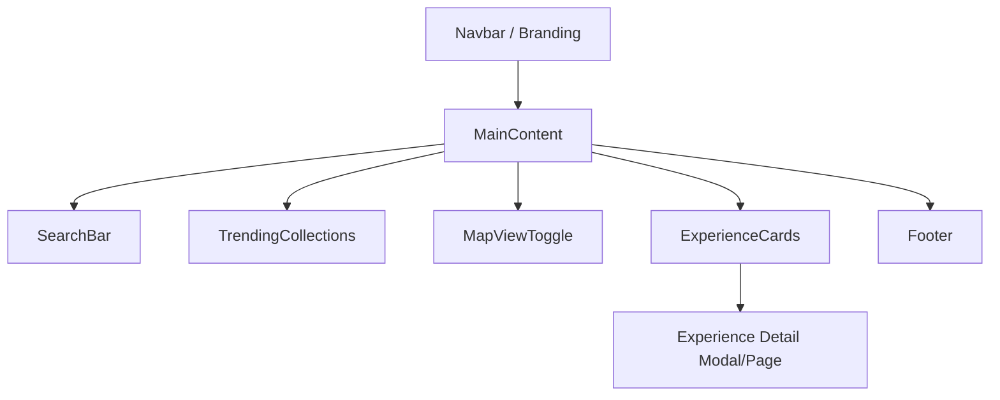

# ChennaiVibe Main Container – Requirements Document

## Overview
The ChennaiVibe Main Container is the primary front-end web application layer for "ChennaiVibe"—a hyperlocal platform designed to help users discover, book, and review unique offbeat experiences and micro-adventures within Chennai. The platform targets Gen Z and Millennials, connecting them with local hosts offering authentic, non-touristy activities, and aims to foster community, creativity, and personal growth.

This requirements document outlines the foundational features, design and architectural principles, UI/UX guidelines, technical stack, integration points, and other essential considerations for both the development and design teams.

---

## 1. Key Features

### 1.1 Hyperlocal Experience Listings
- Users can browse and discover diverse, niche experiences across categories (art, culinary, wellness, culture, skills, urban exploration).
- Listings support advanced sorting and filtering.

### 1.2 Host Profiles
- Each host (individual or small business) has a detailed public profile.
- Profiles include expertise highlights, passions, past experience listings, and participant reviews.

### 1.3 Interactive Maps
- Visual map interface for exploring and geolocating experiences in Chennai.
- Each listing is mapped; users can view nearby experiences.

### 1.4 Advanced Filters
- Users can filter experiences by:
  - Duration
  - Price
  - Category/interest
  - Group size
  - Availability and more

### 1.5 Booking & Payment Integration
- Users can seamlessly book experiences via a secure, in-app checkout flow.
- Real-time calendar availability per experience.
- Payment gateway integration for online bookings.

### 1.6 User Reviews & Media Sharing
- Participants can leave detailed star/text reviews.
- Ability to upload photos and videos of experiences.

### 1.7 Curated Collections & Trends
- Themed collections (seasonal, trending, curated picks).
- Highlight new/popular/unique experiences.

### 1.8 Wishlist & Social Sharing
- Users can save ("wishlist") experiences for later.
- Easy sharing of listing links on social media platforms.

### 1.9 Host Dashboard
- Dedicated dashboard for hosts to:
  - Manage their experience listings
  - Track and manage bookings
  - Respond to reviews
  - View earnings analytics
  - Access resources and support

#### NOTE: "Small Group Booking" is explicitly out-of-scope for this version.

---

## 2. Architecture Principles

### 2.1 Modular Container Structure
- Each major feature (e.g., Listings, Map, Host Profile, Dashboard) should be implemented as a distinct React container/component.
- Promote code and style reuse across different screens.
- Use clear separation of presentation and logic.

### 2.2 Routing and Navigation
- Use React Router for client-side navigation between main sections (Home, Experience Details, Host Dashboard, etc.).
- Stub out routes for anticipated features; ensure flexibility for future additions.

### 2.3 Mobile-First, Responsive Design
- All containers and components should be optimized for mobile.
- Use CSS grid/flex layouts to ensure graceful scaling to desktop and tablet.

### 2.4 Progressive Enhancement
- Base experience should work on all modern browsers, progressively enhanced for richer interactions (e.g., map, media).

### 2.5 Theming and Brand Consistency
- Centralized CSS variables for theme colors, spacing, and typography to maintain visual consistency.

---

## 3. UI/UX Guidelines

### 3.1 Visual Design
- Modern, card-based UI across listings and profiles.
- Use vibrant, high-quality imagery for experiences and hosts.
- Light theme as default.
- ChennaiVibe color palette:
    - Primary: #949494
    - Secondary: #000000
    - Accent: #ffffff

### 3.2 Navigation & Layout
- Persistent top navigation bar with branding and key actions.
- Quick access to home, search, trending collections, map, wishlist, and dashboard.

### 3.3 Home Page Features
- Prominent search bar
- Trending collections carousel/grid
- Map view toggle for experience discovery

### 3.4 Experience Detail Page
- Large experience images, compact info cards, prominent "Book Now" call-to-action.
- Host info and rating.
- Review and media gallery section.

### 3.5 Host Dashboard
- Tabbed interface for managing listings, bookings, earnings, reviews.
- Emphasis on clarity and ease of use (minimalist dashboard approach).

### 3.6 Accessibility
- All interactive elements must be keyboard navigable.
- Sufficient color contrast and focus highlights.

### 3.7 Animation and Feedback
- Smooth transitions between pages.
- Instant feedback on actions (button clicks, form submissions, etc.).

### 3.8 Social & Sharing
- Persistent sharing options on listing and experience pages.
- Seamless add-to-wishlist and share flows.

---

## 4. Technical Stack

### 4.1 Frontend Framework
- React JS (v18 or later)

### 4.2 Language
- JavaScript (ES6+)

### 4.3 Styling
- Pure (vanilla) CSS with CSS variables (defined in `src/App.css`).
- Mobile-first approach.
- No external UI frameworks.

### 4.4 Tooling
- ESLint (with React plugin) for linting
- npm for dependency management and script running

### 4.5 Package Structure
- All app code under `chennai_vibe_frontend` folder.
- Entry points: `src/index.js`, main app logic in `src/App.js`.
- Theming and common styles in `src/App.css`.

---

## 5. Anticipated Integration Points

### 5.1 Backend/API
- While out of scope for this initial frontend-only release, eventual integrations should include:
  - REST endpoints for experience data, bookings, and reviews.
  - Authentication API for user accounts and host logins.
  - Third-party services for maps (e.g., Google Maps or Mapbox) and payment processing.

### 5.2 Payments
- Integration with a secure payment gateway (e.g., Razorpay, Stripe, or similar).

### 5.3 Map Providers
- Interactive map widget integration in experience listing/exploration screens.

### 5.4 Social Sharing
- Support for Open Graph/meta tags for rich sharing.
- Direct social platform sharing flows (e.g., WhatsApp, Instagram).

---

## 6. Exclusions

- Group booking ("Small Group Booking") functionality is NOT to be designed or implemented at this stage.
- No server-side code or backend infrastructure is included in this scope.

---

## 7. Non-Functional Requirements

- Fast load time and snappy UI transitions.
- Codebase must be easy to understand, onboard, and extend.
- Adherence to W3C accessibility guidelines as far as practical.
- Responsive and robust error handling in the frontend.

---

## 8. References and Supporting Files

- See `chennai_vibe_frontend/README.md` for starter template details.
- The main CSS theme variables are defined in `src/App.css`.
- Use the structure and code patterns provided in `src/App.js` for consistent layout.

---

## 9. Success Criteria

- Users can browse, filter, and view experiences seamlessly on both mobile and desktop.
- Hosts have access to a basic dashboard structure.
- All UI elements reflect the ChennaiVibe brand and meet aesthetic guidelines.
- Codebase is linted, passes provided tests, and can be built and run locally via documented scripts.

---

## 10. Appendix: Sample Main Screen Layout (Mermaid Diagram)

---

## 11. Revision & Future Extensions

- This requirements document is intended as a foundation for the initial version.
- Anticipate extension for group bookings, enhanced analytics, and external partner APIs in later phases.
